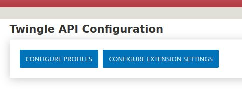

# Configuring the Twingle Profile in CiviCRM

After the installation of the Twingle API extension, various configuration steps must be carried out so that the connection functions smoothly. Among other things, you have to make some settings in the Twingle Profile in CiviCRM.

1. In CiviCRM, go to **Administer**.

2. Choose **Twingle API configuration**.
   
    

3. Then click on **Configure profiles**.
   
    

4. The Twingle configuration is always done with the help of a profile. Please use the Twingle default profile and click on **Edit**.
   
    

5. Then you will identify the Twingle API profile window. Start by entering the corresponding information in the **General settings** section.
   
    

6. Define the different payment methods in the Payments section.
   
    

7. Make the settings for the groups.
   
    

8. When you have made all the settings, please press the **Save** button.
