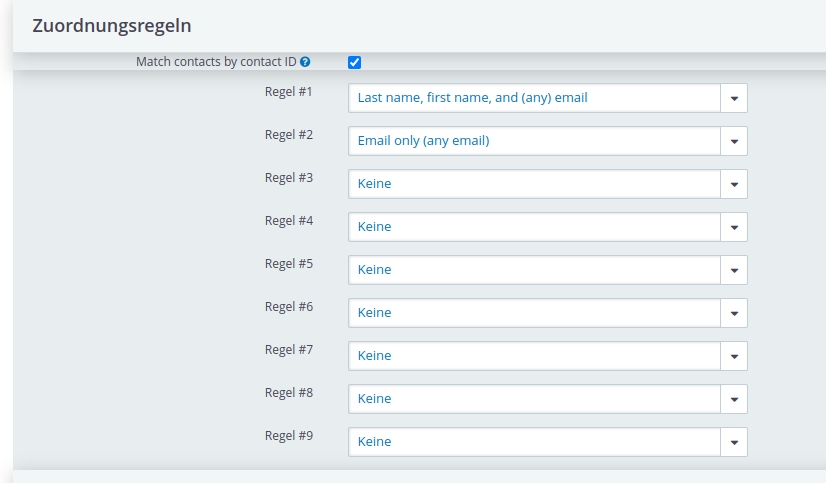
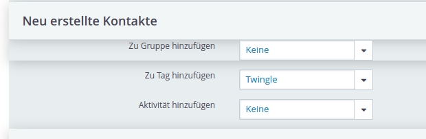
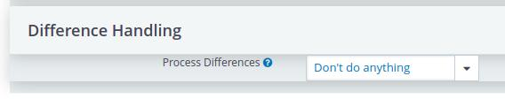

# Twingle API: Configuring the Extended Contact Manager extension (XCM)

After the installation of the Twingle API extension, various configuration steps must be carried out so that the connection functions smoothly. Twingle API works only correctly when you  have previously installed the Extended Contact Manager extension (XCM).

Taking over contact data using the Twingle API means that they may produce duplicates in your CiviCRM contact management. Before contacts are added or updated in CiviCRM a data check should take place to avoid this problem. This data check is handled by the Extended Contact Manager extension (XCM). This extension must be configured accordingly for use with Twingle by defining a corresponding profile.

## Creating a Twingle Profile

Your first task regarding the Extended Contact Manager extension (XCM) configuration will be to create a corresponding Twinge profile. This works best if you copy the Default profile.

1. In CiviCRM, go to **Administer**.

2. Select **Xtended Contact Matcher (XCM) Configuration** in the **System Settings** section.

3. Click on **Copy** in the **Default** profile.

4. Rename the new profile with **Twingle** in the **Profile name** field.

5. Click **Save** at the bottom of this window. In the Profiles overview you can find your new Twingle profile.

## Set up the Extended Contact Manager extension (XCM)

After you have created the Twingle profile, you must enter the configuration settings for the Twingle connection to CiviCRM in this profile. Generally, you will find a description of all the settings in the [Extended Contact Manager (XCM) documentation](https://docs.civicrm.org/xcm/en/latest/configuration/).

Here you will find as support screenshots of the various sections of the Extended Contact Manager extension (XCM). The settings are only an example. Please adapt the settings to your individual requirements or environnement.

#### General section

#### Update section

#### Assignment rules section

#### Identified contacts section

#### New contact section

#### Duplicate section

#### Difference Handling section

