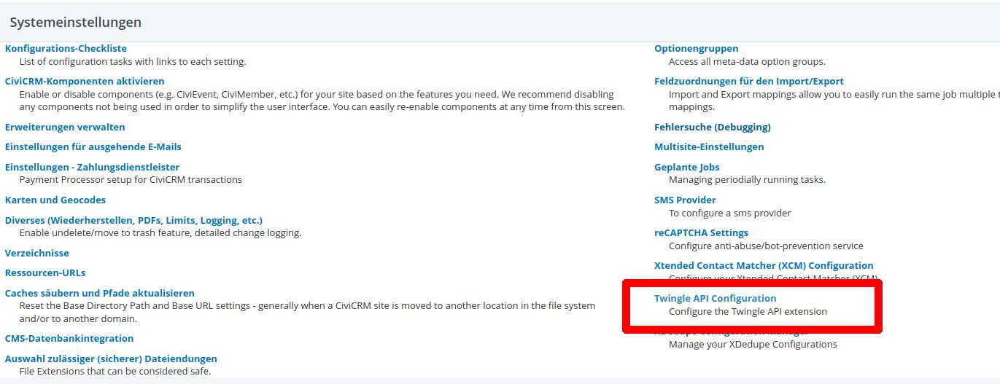

# Activating CiviSEPA integration

The Twingle API extension provides integration with the [
*CiviSEPA*](https://civicrm.org/extensions/civisepa-sepa-direct-debit-extension)
extension. This allows for managing SEPA mandates and collections with
*CiviSEPA* for donations being initiated via a *Twingle* form.

To use the CiviSEPA integration, the CMS user used by this extension must hold the following permissions, in addition to *Twingle API: Access Twingle API* which the user anyway needs:
* *CiviContribute: access CiviContribute*
* *CiviCRM: access CiviCRM backend and API*

If you want to combine the CiviSEPA integration with CiviRules, the CMS user may need additional permissions. For example, to be able to set some default values on custom fields for newly created contacts, the CMS user additionally must hold
* *CiviCRM: view all contacts*
* *CiviSEPA: View SEPA mandates*

However, the CMS user don't need to hold the *CiviSEPA: Create SEPA mandates* permission.

Enable and configure the CiviSEPA integration as following:

1. In CiviCRM, go to **Administer**.
2. Choose **Twingle API configuration**.
   

3. Then click on **Configure extension settings**.
   

4. Tick the boxes **Use CiviSEPA** and **Use CiviSEPA generated reference**.
   These options can only be activated if CiviSEPA is installed and used. If it
   is not activated, the administration of SEPA mandates will have to take place
   in Twingle, which is subject to configuration of your available payment
   methods.
5. Write **TW-** in the **Twingle ID Prefix** field.
   To avoid overlaps when assigning CiviCRM IDs and Twingle transaction IDs, a
   prefix should be assigned here, e.g. "TWNGL" or "Twingle" or similar.
   Attention: The prefix should not be changed later, otherwise problems may
   occur.
6. In the **Protect Recurring Contributions** field select **No**.
   If you choose Yes, all recurring donations created by Twingle can no longer
   be changed in CiviCRM, but must then be changed accordingly in Twingle. If no
   recurring payments are processed via Twingle, but only one-off donations,
   then this does not need to be activated. Otherwise, we strongly recommend
   setting the button here to **Yes** so that there are no discrepancies between
   CiviCRM and Twingle.
   
