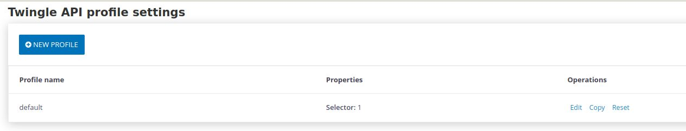
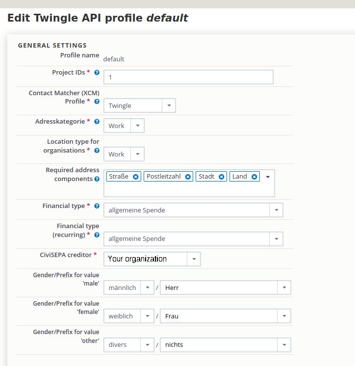
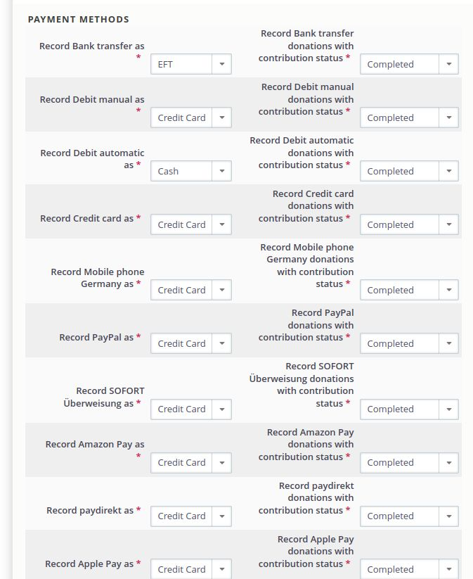
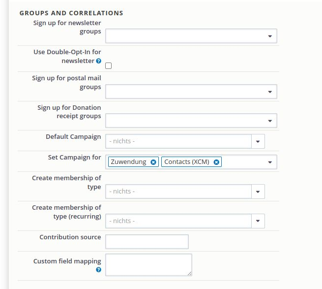

# Configuring the Twingle Profile in CiviCRM

The Twingle API extension is being configured through configuration profiles.
This allows you to have different sets of configuration, as you might want to
handle donation submissions differently, depending on which form was used.
Each profile can react to one ore more form IDs being submitted along with
donation data.

1. In CiviCRM, go to **Administer**.
2. Choose **Twingle API configuration**.
   

3. Then click on **Configure profiles**.
   

4. The Twingle configuration is always done with the help of a profile. Please
   use the Twingle default profile and click on **Edit**.
   

5. Then you will identify the Twingle API profile window. Start by entering the
   corresponding information in the **General settings** section.
   

6. Define the different payment methods in the Payments section.
   

7. Make the settings for the groups.
   

8. When you have made all the settings, please press the **Save** button.
