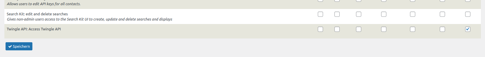
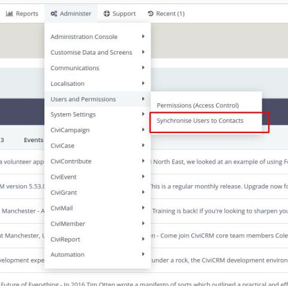
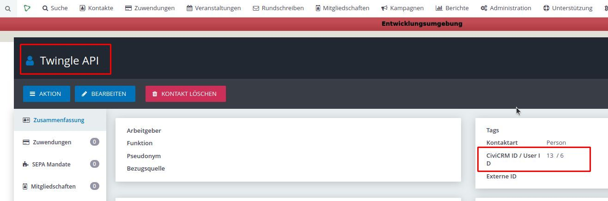
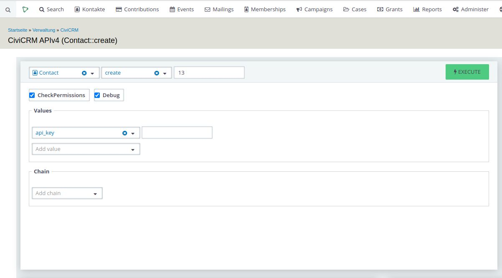

# User, permissions, and API authentication

After the installation of the Twingle API extension, various configuration steps
must be carried out so that the connection functions smoothly. Among other
things, certain configurations must be made on the CMS platform CiviCRM is
implemented on.

Connecting to the Twingle API via CiviCRM's REST interface requires a user with
appropriate permissions in your CMS-system.

You might want to create a specific user role to assign permissions necessary
for calling the Twingle API only. This section describes how to accomplish this
in *Drupal* and *Wordpress*:

## New User Role in Drupal

1. In Drupal, go to **Administration/People/Permissions/Roles**.
2. Type Twingle API in the text box and select  **Add role**. To the right of
   your role there will be a *edit role* function and an *edit permissions*
   button. The *edit permissions* selection will show only the permission
   selections for the individual role.
3. As Permission you only have to select the following entry: **Twingle API:
   Access Twingle API**.

## New User Role in Wordpress

1. In CiviCRM, go to **Administer/User and Permissions (Access Control)**.
2. Then select the **WordPress Access Control** link.
   Here you can adjust the CiviCRM settings for each of the predefined User
   Roles from WordPress.
3. Scroll down. As Permission you only have to select the following entry: *
   *Twingle API: Access Twingle API**.

## New User in Drupal

1. In Drupal, go to **Administration/People**.
2. Then select **Add user**.
3. In user name field enter something like **Twingle API**
5. In Roles select **Twingle API**.

## Take over user

The Twingle API only works correctly if a contact connected to the permissioned
user exists in CiviCRM.

Here, the corresponding steps are described by way of example when using Drupal.

1. In CiviCRM, go to **Administer**.
2. In the **Users and Permissions** section, choose **Synchronize Users to
   Contacts**.

This function checks each user record in Drupal for a contact record in CiviCRM.
If there is no corresponding contact record for a user, a new one will be
generated. Check this in your CiviCRM contact management.

## Assign API key for the Twingle API user

The Twingle API contact in CiviCRM needs their own API key for authenticating
against CiviCRM's REST API endpoint. The API key is assigned with the help of
the API Explorer in CiviCRM.

1. Select the Twingle API contact in CiviCRM.
2. Look for the corresponding **CiviCRM ID** and remember the ID.
3. Go to **Support/Developper/API Explorer v4**.
4. Enter **Contact** in the entity field, **create** in action field and the
   **ID** of the Twingle User in the **index** field.
5. In the values field, select **api_key**.
6. Enter the API key for the Twingle API user in the **add value** field.
7. Click on **Execute**.

!!!note
    You can also create API keys for contacts by using the [*API
    Key*](https://civicrm.org/extensions/api-key) extension or with administrator
    tools like *cv* or *drush*.
